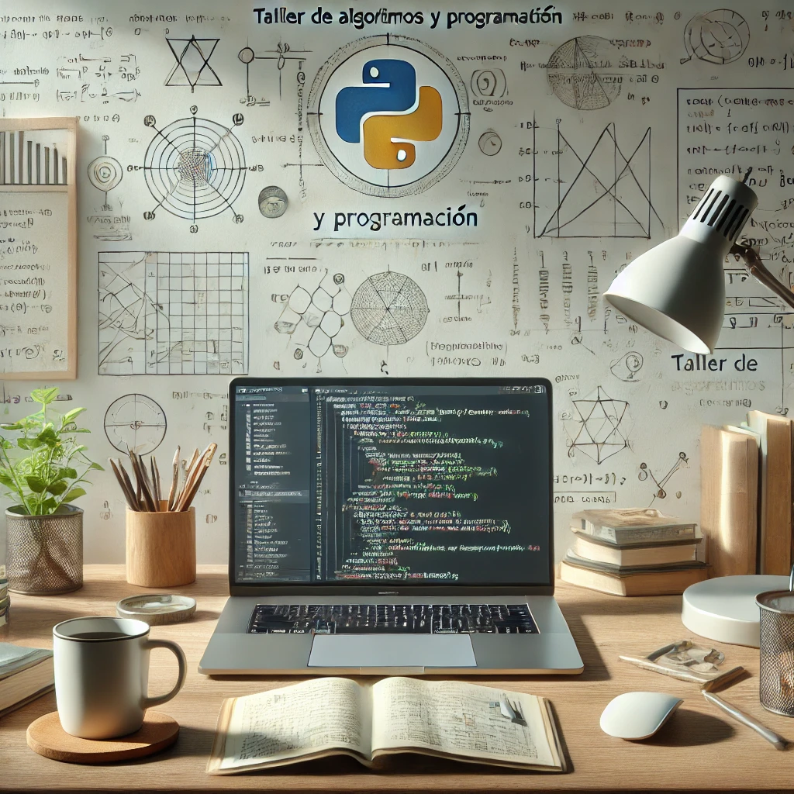

# Taller de Algoritmos y Programación

Este repositorio contiene los códigos fuente, materiales y ejercicios prácticos desarrollados durante el curso **Taller de Algoritmos y Programación** ofrecido por la **Universidad Iberoamericana** en el semestre Primavera 2025.

## Contenido

- **Códigos Fuente**: Implementaciones realizadas durante las sesiones del curso.
- **Prácticas**: Actividades por equipos para afianzar los conocimientos adquiridos.
- **Recursos Complementarios**: Documentación, enlaces y libros sugeridos para apoyar el aprendizaje.
- **Cronograma**: Resumen de los temas y actividades del curso.

## Objetivos del Curso

- Introducir a los estudiantes a la programación y resolución de problemas algorítmicos.
- Desarrollar habilidades en lógica matemática y análisis de algoritmos.
- Aplicar estructuras de control y datos en soluciones de programación.
- Implementar soluciones en Python utilizando mejores prácticas.

## Cronograma de Actividades

### Sesiones y Temas Principales

1. **Introducción al Curso** (14/01): Presentación, revisión de temario y software requerido (Python, Google Colab).
2. **Elementos de Lógica Matemática** (16/01 y 21/01): Lógica proposicional, tablas de verdad y ejercicios.
3. **Análisis de Algoritmos** (30/01 - 06/02): Pseudocódigo, diagramas de flujo, herramientas como PSeint y Raptor.
4. **Introducción a Python** (25/02): Historia, características y configuración.
5. **Elementos de Programación** (27/02 - 04/03): Sintaxis, operadores, estructuras básicas y ejercicios.
6. **Estructuras Repetitivas y de Control** (11/03 - 20/03): Bucles, condicionales y ejercicios prácticos.
7. **Estructuras de Datos** (01/04 - 10/04): Listas, tuplas, matrices y librerías como Numpy y Pandas.

## Políticas del Curso

- **Comunicación**: Toda comunicación oficial será a través de Brightspace y correo institucional.
- **Entregas**: Las actividades deben entregarse en formato PDF a través de Brightspace en las fechas estipuladas.
- **Modalidad de Clases**: Presencial con algunas sesiones en línea en tiempo real. La participación en estas es obligatoria.
- **Evaluaciones**: No se aceptarán entregas fuera de tiempo, y no habrá oportunidades adicionales para mejorar calificaciones.

## Sistema Evaluativo

- **Tareas y Actividades Individuales**: 20%
- **Prácticas en Equipo**: 40%
- **Seminario de Investigación**: 10%
- **Exámenes Parciales**: 30%

## Bibliografía Sugerida

1. Aguilar, L. J. *Fundamentos de programación: Libro de problemas*. McGraw-Hill, 2000.
2. Cormen, T. H., et al. *Introduction to Algorithms*. The MIT Press, 2022.
3. Brass, P. *Advanced Data Structures*. Cambridge University Press, 2019.
4. Karumanchi, N. *Data Structures and Algorithms Made Easy*. CareerMonk, 2020.
5. Skiena, S. *Algorithm Design Manual*. Springer, 2021.

## Contribuir

¡Contribuciones al repositorio son bienvenidas! Si deseas agregar ejercicios, material de estudio o mejoras al código, abre un pull request. Recuerda seguir las normas del curso.

## Contacto del Instructor

- **Nombre**: Dr. Lázaro Bustio Martínez  
- **Correo**: <lazaro.bustio@ibero.mx>  
- **Oficina**: Edificio G, Cubículo 022  
- **Teléfono**: 55 5950-4000, ext. 7459  

¡Gracias por participar en este curso! Aprende, experimenta y disfruta de la programación.
